# West Nile Virus in Chicago
Syed Rahman  
10/9/2017  


## West Nile Virus

West Nile virus is most commonly spread to humans through infected mosquitos. Around 20% of people who become infected with the virus develop symptoms ranging from a persistent fever, to serious neurological illnesses that can result in death. 

We want to understand what factors make drive mosquito populations and the presence of West Nile Virus, and how the City of Chicago can make decisions to minimize the number of people affected by the virus.

## Data

  The data comes from <https://www.kaggle.com/c/predict-west-nile-virus/data>.

I have used the training dataset

Date         Address                                              Species                   Block  Street           Trap   AddressNumberAndStreet               Latitude   Longitude   AddressAccuracy   NumMosquitos   WnvPresent
-----------  ---------------------------------------------------  -----------------------  ------  ---------------  -----  ----------------------------------  ---------  ----------  ----------------  -------------  -----------
2007-05-29   4100 North Oak Park Avenue, Chicago, IL 60634, USA   CULEX PIPIENS/RESTUANS       41  N OAK PARK AVE   T002   4100  N OAK PARK AVE, Chicago, IL    41.95469   -87.80099                 9              1            0
2007-05-29   4100 North Oak Park Avenue, Chicago, IL 60634, USA   CULEX RESTUANS               41  N OAK PARK AVE   T002   4100  N OAK PARK AVE, Chicago, IL    41.95469   -87.80099                 9              1            0
2007-05-29   6200 North Mandell Avenue, Chicago, IL 60646, USA    CULEX RESTUANS               62  N MANDELL AVE    T007   6200  N MANDELL AVE, Chicago, IL     41.99499   -87.76928                 9              1            0
2007-05-29   7900 West Foster Avenue, Chicago, IL 60656, USA      CULEX PIPIENS/RESTUANS       79  W FOSTER AVE     T015   7900  W FOSTER AVE, Chicago, IL      41.97409   -87.82481                 8              1            0
2007-05-29   7900 West Foster Avenue, Chicago, IL 60656, USA      CULEX RESTUANS               79  W FOSTER AVE     T015   7900  W FOSTER AVE, Chicago, IL      41.97409   -87.82481                 8              4            0
2007-05-29   1500 West Webster Avenue, Chicago, IL 60614, USA     CULEX RESTUANS               15  W WEBSTER AVE    T045   1500  W WEBSTER AVE, Chicago, IL     41.92160   -87.66645                 8              2            0

and the weather dataset

 Station  Date         Tmax   Tmin   Tavg   Depart   DewPoint   WetBulb   Heat   Cool   Sunrise   Sunset   CodeSum   Depth   Water1   SnowFall   PrecipTotal   StnPressure   SeaLevel   ResultSpeed   ResultDir   AvgSpeed 
--------  -----------  -----  -----  -----  -------  ---------  --------  -----  -----  --------  -------  --------  ------  -------  ---------  ------------  ------------  ---------  ------------  ----------  ---------
       1  2007-05-01   83     50     67     14       51         56        0      2      0448      1849               0       M        0.0        0.00          29.10         29.82      1.7           27          9.2      
       2  2007-05-01   84     52     68     M        51         57        0      3      -         -                  M       M        M          0.00          29.18         29.82      2.7           25          9.6      
       1  2007-05-02   59     42     51     -3       42         47        14     0      0447      1850     BR        0       M        0.0        0.00          29.38         30.09      13            4           13.4     
       2  2007-05-02   60     43     52     M        42         47        13     0      -         -        BR HZ     M       M        M          0.00          29.44         30.08      13.3          2           13.4     
       1  2007-05-03   66     46     56     2        40         48        9      0      0446      1851               0       M        0.0        0.00          29.39         30.12      11.7          7           11.9     
       2  2007-05-03   67     48     58     M        40         50        7      0      -         -        HZ        M       M        M          0.00          29.46         30.12      12.9          6           13.2     


## Data Exploration

First we merge the weather data with the train data based on date. From the date, we extract further information such as day in year and month which we will use with our models. Some other varaibles that could affect mosquito behavior is Tmax-Tmin and duration of sunlight, which are also created and added to the dataset. 


```
## `mutate_each()` is deprecated.
## Use `mutate_all()`, `mutate_at()` or `mutate_if()` instead.
## To map `funs` over a selection of variables, use `mutate_at()`
```

```
## Warning in eval(substitute(expr), envir, enclos): NAs introduced by
## coercion

## Warning in eval(substitute(expr), envir, enclos): NAs introduced by
## coercion

## Warning in eval(substitute(expr), envir, enclos): NAs introduced by
## coercion

## Warning in eval(substitute(expr), envir, enclos): NAs introduced by
## coercion

## Warning in eval(substitute(expr), envir, enclos): NAs introduced by
## coercion
```

```
## `summarise_each()` is deprecated.
## Use `summarise_all()`, `summarise_at()` or `summarise_if()` instead.
## To map `funs` over all variables, use `summarise_all()`
## `mutate_each()` is deprecated.
## Use `mutate_all()`, `mutate_at()` or `mutate_if()` instead.
## To map `funs` over a selection of variables, use `mutate_at()`
```

```
## Warning in `[.data.table`(train, , `:=`(Long, project(cbind(train
## $Latitude, : Supplied 21011 items to be assigned to 10506 items of column
## 'Long' (10505 unused)
```

Then we check out some conditional probabilities to see what factors seem to have a large effect.


```
##                  Species2         V1
## 1:       CULEX SALINARIUS 0.00000000
## 2:        CULEX TERRITANS 0.00000000
## 3:         CULEX TARSALIS 0.00000000
## 4:        CULEX ERRATICUS 0.00000000
## 5:         CULEX RESTUANS 0.01788321
## 6: CULEX PIPIENS/RESTUANS 0.05513468
## 7:          CULEX PIPIENS 0.08892182
```

```
##    dMonth           V1
## 1:     05 0.0000000000
## 2:     06 0.0006365372
## 3:     10 0.0072463768
## 4:     07 0.0176515733
## 5:     09 0.0563570784
## 6:     08 0.1005065316
```

```
##     Latitude Longitude          V1
## 1   41.99499 -87.76928 0.000000000
## 2   41.89112 -87.65449 0.000000000
## 3   41.91934 -87.69426 0.000000000
## 4   41.89113 -87.61156 0.000000000
## 5   42.01743 -87.68777 0.000000000
## 6   41.90765 -87.76089 0.000000000
## 7   41.94983 -87.69846 0.000000000
## 8   41.97924 -87.75094 0.000000000
## 9   41.86922 -87.62756 0.000000000
## 10  41.96174 -87.76007 0.000000000
## 11  41.95827 -87.70257 0.000000000
## 12  41.99447 -87.66774 0.000000000
## 13  42.00686 -87.67592 0.000000000
## 14  41.95370 -87.73397 0.000000000
## 15  41.84381 -87.68676 0.000000000
## 16  41.85265 -87.71989 0.000000000
## 17  41.85740 -87.69499 0.000000000
## 18  41.84628 -87.65691 0.000000000
## 19  41.86911 -87.69629 0.000000000
## 20  41.71906 -87.67509 0.000000000
## 21  41.96699 -87.67468 0.000000000
## 22  42.01041 -87.66214 0.000000000
## 23  41.96062 -87.77719 0.000000000
## 24  41.88328 -87.70508 0.000000000
## 25  41.96273 -87.74837 0.000000000
## 26  41.82306 -87.67838 0.000000000
## 27  41.78142 -87.77653 0.000000000
## 28  41.79928 -87.58549 0.000000000
## 29  41.79478 -87.61599 0.000000000
## 30  41.73705 -87.54307 0.000000000
## 31  41.74785 -87.70272 0.000000000
## 32  41.77505 -87.65536 0.000000000
## 33  41.73364 -87.55551 0.000000000
## 34  41.71775 -87.53166 0.000000000
## 35  41.82590 -87.66783 0.000000000
## 36  41.75341 -87.63982 0.000000000
## 37  41.73890 -87.69544 0.000000000
## 38  41.75339 -87.70739 0.000000000
## 39  41.71914 -87.66954 0.000000000
## 40  41.67862 -87.55931 0.007751938
## 41  41.87811 -87.62980 0.010989011
## 42  41.89628 -87.65523 0.011764706
## 43  41.76839 -87.67865 0.012048193
## 44  41.76620 -87.56289 0.012048193
## 45  41.80074 -87.71188 0.012195122
## 46  41.92520 -87.74638 0.016666667
## 47  41.82254 -87.66634 0.017391304
## 48  41.75050 -87.60529 0.017857143
## 49  41.94723 -87.67146 0.018518519
## 50  41.82561 -87.72655 0.019230769
## 51  41.68095 -87.53520 0.019736842
## 52  41.84607 -87.71628 0.021505376
## 53  41.75468 -87.61292 0.021739130
## 54  41.74064 -87.54659 0.023076923
## 55  41.86814 -87.69627 0.026315789
## 56  41.94817 -87.73070 0.027027027
## 57  41.94016 -87.79490 0.027027027
## 58  41.75429 -87.59077 0.027027027
## 59  41.86711 -87.65422 0.027397260
## 60  41.72147 -87.64806 0.030303030
## 61  41.77875 -87.58643 0.030303030
## 62  41.99468 -87.77090 0.030303030
## 63  41.86229 -87.64886 0.031250000
## 64  41.77322 -87.60088 0.031250000
## 65  41.72085 -87.66601 0.033057851
## 66  41.75935 -87.74560 0.033333333
## 67  41.80150 -87.76342 0.034246575
## 68  41.92118 -87.79518 0.034482759
## 69  41.73298 -87.64964 0.036036036
## 70  41.92197 -87.63209 0.036809816
## 71  41.83664 -87.67774 0.037037037
## 72  41.99143 -87.74711 0.038095238
## 73  41.91627 -87.80052 0.038461538
## 74  41.69255 -87.59887 0.040000000
## 75  41.91256 -87.66805 0.040000000
## 76  41.93209 -87.70012 0.040816327
## 77  41.68259 -87.70797 0.040816327
## 78  41.96398 -87.69181 0.040816327
## 79  41.83709 -87.72938 0.041666667
## 80  41.66201 -87.72461 0.043715847
## 81  41.72319 -87.64997 0.043956044
## 82  41.90300 -87.68827 0.043956044
## 83  41.76373 -87.74230 0.044444444
## 84  41.77830 -87.75241 0.045871560
## 85  41.86808 -87.66690 0.046357616
## 86  41.72552 -87.61426 0.047619048
## 87  41.77285 -87.74003 0.047619048
## 88  41.91182 -87.72674 0.050000000
## 89  41.72646 -87.58541 0.050955414
## 90  41.72850 -87.60096 0.051282051
## 91  41.90664 -87.70143 0.051546392
## 92  41.77166 -87.70305 0.051724138
## 93  41.79382 -87.65423 0.051948052
## 94  41.95307 -87.77679 0.055555556
## 95  41.70434 -87.70374 0.055555556
## 96  41.64461 -87.60450 0.058823529
## 97  41.79870 -87.73681 0.060810811
## 98  41.89923 -87.71679 0.063492063
## 99  41.68640 -87.53163 0.066666667
## 100 41.82158 -87.62780 0.068181818
## 101 41.70457 -87.56567 0.068750000
## 102 41.77616 -87.77893 0.069767442
## 103 41.95780 -87.93099 0.071428571
## 104 42.00831 -87.77792 0.071942446
## 105 41.70272 -87.53650 0.072289157
## 106 41.99248 -87.86299 0.075000000
## 107 41.98481 -87.72849 0.075268817
## 108 41.67341 -87.59986 0.075645756
## 109 41.98692 -87.68978 0.076923077
## 110 41.80118 -87.67945 0.077669903
## 111 41.65911 -87.53869 0.080357143
## 112 41.80342 -87.64298 0.081632653
## 113 41.94487 -87.83276 0.082706767
## 114 41.92160 -87.66645 0.085714286
## 115 41.97469 -87.89061 0.088000000
## 116 41.72967 -87.58270 0.090909091
## 117 41.68832 -87.67671 0.093023256
## 118 41.91871 -87.75233 0.095238095
## 119 41.98728 -87.66607 0.095238095
## 120 41.92374 -87.78529 0.096153846
## 121 41.98196 -87.81283 0.096774194
## 122 41.95187 -87.72506 0.096774194
## 123 41.95469 -87.80099 0.097297297
## 124 41.79762 -87.79789 0.100000000
## 125 41.97384 -87.80506 0.103448276
## 126 42.01160 -87.81151 0.106060606
## 127 41.74340 -87.73144 0.106796117
## 128 41.90419 -87.75616 0.107692308
## 129 41.92565 -87.63359 0.111111111
## 130 41.77643 -87.62710 0.112903226
## 131 41.97409 -87.82481 0.114285714
## 132 41.96424 -87.75764 0.114754098
## 133 41.73192 -87.67751 0.120000000
## 134 41.97025 -87.78799 0.133333333
## 135 42.00988 -87.80728 0.140000000
## 136 41.94211 -87.77639 0.142857143
## 137 41.99028 -87.79713 0.166666667
## 138 41.99913 -87.79559 0.193548387
```

We also look at correlations between the numeric variables as we want to avoid using variables with a very high correlation.


                        Block     Latitude    Longitude   AddressAccuracy   NumMosquitos   WnvPresent         Tmax         Tmin     DewPoint   WetBulb         Heat         Cool   PrecipTotal   ResultSpeed    ResultDir     AvgSpeed      Sunrise       Sunset   dDay_num   dMonth_num          Lat         Long    dayofyear    Tmax_Tmin   Sunset_Sunrise
----------------  -----------  -----------  -----------  ----------------  -------------  -----------  -----------  -----------  -----------  --------  -----------  -----------  ------------  ------------  -----------  -----------  -----------  -----------  ---------  -----------  -----------  -----------  -----------  -----------  ---------------
Block               1.0000000    0.0911100   -0.0903752         0.2221344     -0.1723877    0.0048775   -0.0016256   -0.0125850   -0.0044429        NA   -0.0003056   -0.0086793            NA    -0.0087376    0.0183810   -0.0137002   -0.0062056   -0.0028744         NA    0.0102626   -0.1973882   -0.0069478    0.0046918    0.0154816        0.0009370
Latitude            0.0911100    1.0000000   -0.7017950         0.4440263     -0.1848057    0.0286968   -0.0658031   -0.0973963   -0.0646013        NA    0.0433015   -0.0905103            NA     0.0262451    0.0070082   -0.0009465   -0.0674678    0.0367951         NA   -0.0852186   -0.3029214   -0.0374337   -0.0768640    0.0354270        0.0501307
Longitude          -0.0903752   -0.7017950    1.0000000        -0.4567753      0.0366329   -0.0603451    0.0810592    0.1011852    0.0868681        NA   -0.0546534    0.0991347            NA    -0.0228752    0.0017758    0.0100728    0.0769362   -0.0506557         NA    0.0970037    0.1011254    0.0518473    0.0860714   -0.0166750       -0.0622712
AddressAccuracy     0.2221344    0.4440263   -0.4567753         1.0000000     -0.2484138    0.0080637   -0.0748396   -0.1072533   -0.0815346        NA    0.0401928   -0.1048439            NA     0.0063942    0.0115913   -0.0168523   -0.0680347    0.0390548         NA   -0.0749831   -0.0964669   -0.0310442   -0.0749267    0.0352439        0.0516969
NumMosquitos       -0.1723877   -0.1848057    0.0366329        -0.2484138      1.0000000    0.1968196    0.1593101    0.1963252    0.1592644        NA   -0.1302545    0.1835113            NA     0.0036584   -0.0336741    0.0266859   -0.0448440    0.0888841         NA   -0.0260404    0.0181817    0.0099748   -0.0219490   -0.0291281        0.0711405
WnvPresent          0.0048775    0.0286968   -0.0603451         0.0080637      0.1968196    1.0000000    0.0482436    0.0740484    0.0858827        NA   -0.0547399    0.0581007            NA    -0.0462981    0.0001753   -0.0294155    0.1052275   -0.0684515         NA    0.1001433   -0.0056278   -0.0012878    0.1057675   -0.0297649       -0.0846817
Tmax               -0.0016256   -0.0658031    0.0810592        -0.0748396      0.1593101    0.0482436    1.0000000    0.7852157    0.7456875        NA   -0.7401743    0.8925798            NA    -0.0462285    0.1535710   -0.0199735   -0.1197138    0.2202947         NA   -0.0022340    0.0129734    0.0139334   -0.0198220    0.4587716        0.1799422
Tmin               -0.0125850   -0.0973963    0.1011852        -0.1072533      0.1963252    0.0740484    0.7852157    1.0000000    0.8988515        NA   -0.6812733    0.9038766            NA     0.0189242    0.0904733    0.1140066   -0.1760842    0.2790026         NA   -0.0644424    0.0155252    0.0216345   -0.0492099   -0.1899780        0.2382432
DewPoint           -0.0044429   -0.0646013    0.0868681        -0.0815346      0.1592644    0.0858827    0.7456875    0.8988515    1.0000000        NA   -0.6141911    0.8401590            NA    -0.0368976    0.0875073    0.0875820   -0.0782140    0.1799026         NA   -0.0261387    0.0098371    0.0158673    0.0031241   -0.1075074        0.1386817
WetBulb                    NA           NA           NA                NA             NA           NA           NA           NA           NA         1           NA           NA            NA            NA           NA           NA           NA           NA         NA           NA           NA           NA           NA           NA               NA
Heat               -0.0003056    0.0433015   -0.0546534         0.0401928     -0.1302545   -0.0547399   -0.7401743   -0.6812733   -0.6141911        NA    1.0000000   -0.5123896            NA     0.0323179   -0.1219344    0.0252683    0.1855801   -0.2699026         NA    0.0903009   -0.0091294   -0.0043025    0.0790968   -0.1959655       -0.2369171
Cool               -0.0086793   -0.0905103    0.0991347        -0.1048439      0.1835113    0.0581007    0.8925798    0.9038766    0.8401590        NA   -0.5123896    1.0000000            NA    -0.0100582    0.1122738    0.0694831   -0.1156500    0.2152591         NA    0.0003513    0.0151738    0.0222152   -0.0084182    0.1181822        0.1752678
PrecipTotal                NA           NA           NA                NA             NA           NA           NA           NA           NA        NA           NA           NA             1            NA           NA           NA           NA           NA         NA           NA           NA           NA           NA           NA               NA
ResultSpeed        -0.0087376    0.0262451   -0.0228752         0.0063942      0.0036584   -0.0462981   -0.0462285    0.0189242   -0.0368976        NA    0.0323179   -0.0100582            NA     1.0000000    0.2619994    0.9025022   -0.1158291    0.0678387         NA   -0.1702493   -0.0219911    0.0051882   -0.1379239   -0.1004514        0.0888053
ResultDir           0.0183810    0.0070082    0.0017758         0.0115913     -0.0336741    0.0001753    0.1535710    0.0904733    0.0875073        NA   -0.1219344    0.1122738            NA     0.2619994    1.0000000    0.3163054    0.0722150   -0.0329423         NA    0.0468195   -0.0022425    0.0100300    0.1000516    0.1136649       -0.0498766
AvgSpeed           -0.0137002   -0.0009465    0.0100728        -0.0168523      0.0266859   -0.0294155   -0.0199735    0.1140066    0.0875820        NA    0.0252683    0.0694831            NA     0.9025022    0.3163054    1.0000000   -0.0879775    0.0519699         NA   -0.1743117   -0.0199591    0.0125303   -0.1202822   -0.1952624        0.0677119
Sunrise            -0.0062056   -0.0674678    0.0769362        -0.0680347     -0.0448440    0.1052275   -0.1197138   -0.1760842   -0.0782140        NA    0.1855801   -0.1156500            NA    -0.1158291    0.0722150   -0.0879775    1.0000000   -0.9599003         NA    0.8879016    0.0338975   -0.0104713    0.9417799    0.0628639       -0.9863662
Sunset             -0.0028744    0.0367951   -0.0506557         0.0390548      0.0888841   -0.0684515    0.2202947    0.2790026    0.1799026        NA   -0.2699026    0.2152591            NA     0.0678387   -0.0329423    0.0519699   -0.9599003    1.0000000         NA   -0.8525787   -0.0270408    0.0162040   -0.9075082   -0.0510740        0.9929477
dDay_num                   NA           NA           NA                NA             NA           NA           NA           NA           NA        NA           NA           NA            NA            NA           NA           NA           NA           NA          1           NA           NA           NA           NA           NA               NA
dMonth_num          0.0102626   -0.0852186    0.0970037        -0.0749831     -0.0260404    0.1001433   -0.0022340   -0.0644424   -0.0261387        NA    0.0903009    0.0003513            NA    -0.1702493    0.0468195   -0.1743117    0.8879016   -0.8525787         NA    1.0000000    0.0365304   -0.0050121    0.9623319    0.0889297       -0.8759615
Lat                -0.1973882   -0.3029214    0.1011254        -0.0964669      0.0181817   -0.0056278    0.0129734    0.0155252    0.0098371        NA   -0.0091294    0.0151738            NA    -0.0219911   -0.0022425   -0.0199591    0.0338975   -0.0270408         NA    0.0365304    1.0000000    0.0036254    0.0367078   -0.0017084       -0.0302083
Long               -0.0069478   -0.0374337    0.0518473        -0.0310442      0.0099748   -0.0012878    0.0139334    0.0216345    0.0158673        NA   -0.0043025    0.0222152            NA     0.0051882    0.0100300    0.0125303   -0.0104713    0.0162040         NA   -0.0050121    0.0036254    1.0000000   -0.0095362   -0.0089527        0.0139402
dayofyear           0.0046918   -0.0768640    0.0860714        -0.0749267     -0.0219490    0.1057675   -0.0198220   -0.0492099    0.0031241        NA    0.0790968   -0.0084182            NA    -0.1379239    0.1000516   -0.1202822    0.9417799   -0.9075082         NA    0.9623319    0.0367078   -0.0095362    1.0000000    0.0391857       -0.9309905
Tmax_Tmin           0.0154816    0.0354270   -0.0166750         0.0352439     -0.0291281   -0.0297649    0.4587716   -0.1899780   -0.1075074        NA   -0.1959655    0.1181822            NA    -0.1004514    0.1136649   -0.1952624    0.0628639   -0.0510740         NA    0.0889297   -0.0017084   -0.0089527    0.0391857    1.0000000       -0.0565657
Sunset_Sunrise      0.0009370    0.0501307   -0.0622712         0.0516969      0.0711405   -0.0846817    0.1799422    0.2382432    0.1386817        NA   -0.2369171    0.1752678            NA     0.0888053   -0.0498766    0.0677119   -0.9863662    0.9929477         NA   -0.8759615   -0.0302083    0.0139402   -0.9309905   -0.0565657        1.0000000

Then we merge the rows where mosquito count is equal to 50 with the following rows provided it is the same traps.


## Presence of West Nile Virus

We use 2013 as the test set and the prior years as the training set. We use Sunset and not the others because Sunset and duration of sunlight is highly correlated, but including them in the model didn't make much sense. 


```r
### Start modeling
## use 2013 as a cross validation year; x1 will include the other three years; x2 will include 2013, factor Species2 has new levels CULEX ERRATICUS, so remove those too
x1<-train[dYear!=2013,]
x2<-na.omit(train[(dYear==2013 & Species2!='CULEX ERRATICUS'),])
```

The simplest model we try is the logistic regression.

```
## Warning: glm.fit: fitted probabilities numerically 0 or 1 occurred
```

```
## 
## Call:
## glm(formula = WnvPresent ~ dMonth + Block + Species2 + DewPoint + 
##     NumMosquitos + Latitude * Longitude + DewPoint * Sunset + 
##     AvgSpeed + WetBulb + Tmax * Tmin * PrecipTotal, family = "binomial", 
##     data = x1)
## 
## Deviance Residuals: 
##     Min       1Q   Median       3Q      Max  
## -1.0692  -0.2769  -0.1578  -0.0634   3.4106  
## 
## Coefficients:
##                            Estimate Std. Error z value Pr(>|z|)    
## (Intercept)               1.744e+05  2.953e+04   5.905 3.54e-09 ***
## dMonth06                  1.957e+00  1.848e+03   0.001  0.99915    
## dMonth07                  1.810e+01  1.796e+03   0.010  0.99196    
## dMonth08                  2.033e+01  1.796e+03   0.011  0.99097    
## dMonth09                  1.970e+01  1.796e+03   0.011  0.99125    
## dMonth10                  2.010e+01  1.796e+03   0.011  0.99107    
## Block                    -2.874e-03  3.003e-03  -0.957  0.33866    
## Species2CULEX RESTUANS   -7.734e-01  2.638e-01  -2.931  0.00337 ** 
## Species2CULEX PIPIENS     7.080e-02  1.574e-01   0.450  0.65287    
## Species2CULEX SALINARIUS -1.749e+01  1.908e+03  -0.009  0.99268    
## Species2CULEX TERRITANS  -1.753e+01  1.179e+03  -0.015  0.98814    
## Species2CULEX TARSALIS   -1.702e+01  6.826e+03  -0.002  0.99801    
## DewPoint                  1.797e+00  7.866e-01   2.284  0.02236 *  
## NumMosquitos             -4.455e-05  6.315e-04  -0.071  0.94376    
## Latitude                 -4.183e+03  7.044e+02  -5.939 2.87e-09 ***
## Longitude                 1.988e+03  3.361e+02   5.915 3.32e-09 ***
## Sunset                    4.485e-02  2.465e-02   1.820  0.06878 .  
## AvgSpeed                 -5.894e-02  5.055e-02  -1.166  0.24368    
## WetBulb                  -8.260e-01  2.997e-01  -2.756  0.00586 ** 
## Tmax                     -2.068e-01  1.486e-01  -1.392  0.16399    
## Tmin                     -1.640e-01  2.106e-01  -0.779  0.43605    
## PrecipTotal              -9.389e+02  1.971e+02  -4.763 1.91e-06 ***
## Latitude:Longitude       -4.768e+01  8.031e+00  -5.936 2.91e-09 ***
## DewPoint:Sunset          -6.826e-04  4.028e-04  -1.695  0.09010 .  
## Tmax:Tmin                 4.173e-03  2.375e-03   1.757  0.07887 .  
## Tmax:PrecipTotal          1.088e+01  2.312e+00   4.705 2.54e-06 ***
## Tmin:PrecipTotal          1.301e+01  2.739e+00   4.748 2.06e-06 ***
## Tmax:Tmin:PrecipTotal    -1.506e-01  3.214e-02  -4.687 2.77e-06 ***
## ---
## Signif. codes:  0 '***' 0.001 '**' 0.01 '*' 0.05 '.' 0.1 ' ' 1
## 
## (Dispersion parameter for binomial family taken to be 1)
## 
##     Null deviance: 1824.6  on 5615  degrees of freedom
## Residual deviance: 1428.8  on 5588  degrees of freedom
##   (1097 observations deleted due to missingness)
## AIC: 1484.8
## 
## Number of Fisher Scoring iterations: 19
```

```
## Area under the curve: 0.7834
```

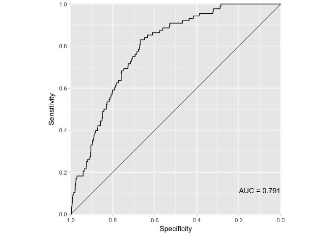<!-- -->

We also only have 312 cases. Hence we create a case-control sample and run a logistic regression on that.


```
## Warning: glm.fit: fitted probabilities numerically 0 or 1 occurred
```

```
## 
## Call:
## glm(formula = WnvPresent ~ dMonth + Species2 + Block + DewPoint + 
##     NumMosquitos + Latitude * Longitude + DewPoint * Sunset + 
##     AvgSpeed + WetBulb + Tmax * Tmin * PrecipTotal, family = "binomial", 
##     data = x3)
## 
## Deviance Residuals: 
##     Min       1Q   Median       3Q      Max  
## -2.4738  -0.7820   0.0000   0.7041   2.1456  
## 
## Coefficients:
##                            Estimate Std. Error z value Pr(>|z|)    
## (Intercept)               1.298e+05  5.508e+04   2.357 0.018416 *  
## dMonth06                  9.877e-01  6.177e+03   0.000 0.999872    
## dMonth07                  2.033e+01  6.120e+03   0.003 0.997350    
## dMonth08                  2.288e+01  6.120e+03   0.004 0.997017    
## dMonth09                  2.301e+01  6.120e+03   0.004 0.997000    
## dMonth10                  2.459e+01  6.120e+03   0.004 0.996794    
## Species2CULEX RESTUANS   -5.318e-01  3.887e-01  -1.368 0.171281    
## Species2CULEX PIPIENS     5.180e-02  2.909e-01   0.178 0.858662    
## Species2CULEX SALINARIUS -1.992e+01  4.687e+03  -0.004 0.996609    
## Species2CULEX TERRITANS  -1.853e+01  3.838e+03  -0.005 0.996148    
## Species2CULEX TARSALIS   -1.878e+01  1.075e+04  -0.002 0.998606    
## Block                    -3.850e-03  5.255e-03  -0.733 0.463755    
## DewPoint                  2.370e+00  1.190e+00   1.992 0.046407 *  
## NumMosquitos              1.220e-03  2.237e-03   0.546 0.585342    
## Latitude                 -3.120e+03  1.308e+03  -2.386 0.017034 *  
## Longitude                 1.480e+03  6.242e+02   2.371 0.017755 *  
## Sunset                    6.386e-02  3.789e-02   1.685 0.091919 .  
## AvgSpeed                 -8.777e-02  7.752e-02  -1.132 0.257549    
## WetBulb                  -1.166e+00  4.663e-01  -2.500 0.012414 *  
## Tmax                     -2.859e-01  2.312e-01  -1.236 0.216325    
## Tmin                     -2.427e-01  3.277e-01  -0.741 0.458894    
## PrecipTotal              -1.046e+03  3.155e+02  -3.317 0.000910 ***
## Latitude:Longitude       -3.554e+01  1.491e+01  -2.383 0.017166 *  
## DewPoint:Sunset          -8.652e-04  6.272e-04  -1.379 0.167759    
## Tmax:Tmin                 5.866e-03  3.549e-03   1.653 0.098313 .  
## Tmax:PrecipTotal          1.225e+01  3.766e+00   3.252 0.001147 ** 
## Tmin:PrecipTotal          1.456e+01  4.361e+00   3.338 0.000844 ***
## Tmax:Tmin:PrecipTotal    -1.704e-01  5.203e-02  -3.275 0.001057 ** 
## ---
## Signif. codes:  0 '***' 0.001 '**' 0.01 '*' 0.05 '.' 0.1 ' ' 1
## 
## (Dispersion parameter for binomial family taken to be 1)
## 
##     Null deviance: 601.61  on 433  degrees of freedom
## Residual deviance: 390.35  on 406  degrees of freedom
##   (94 observations deleted due to missingness)
## AIC: 446.35
## 
## Number of Fisher Scoring iterations: 18
```

```
## Area under the curve: 0.7853
```

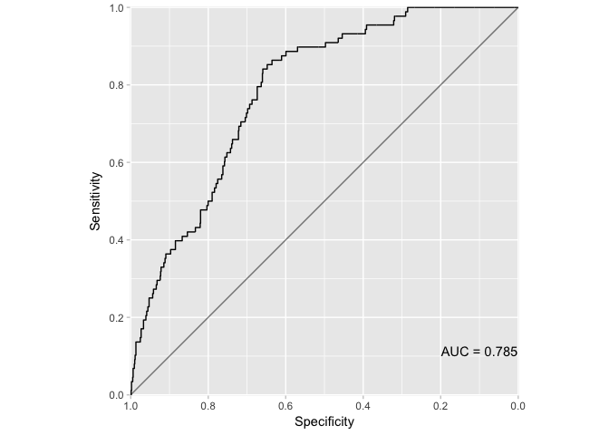<!-- -->

This actually does a little bit worse. Hence, we stick to using the entire sample. We will fit a few additional models to compare the performance of our logistic regression. The first is a GAM.


```
## Warning in smooth.construct.tensor.smooth.spec(object, dk$data, dk$knots):
## reparameterization unstable for margin: not done
```

```
## 
## Family: binomial 
## Link function: logit 
## 
## Formula:
## WnvPresent ~ dMonth + Species2 + s(Block) + s(NumMosquitos) + 
##     s(AvgSpeed) + s(WetBulb) + te(Tmax_Tmin, PrecipTotal, d = c(1, 
##     1), k = c(9, 9), bs = c("tp", "tp")) + te(DewPoint, Sunset, 
##     d = c(1, 1), k = c(9, 9), bs = c("tp", "tp")) + te(Lat, Long, 
##     dayofyear, d = c(2, 1), k = c(55, 9), bs = c("tp", "cc"))
## 
## Parametric coefficients:
##                            Estimate Std. Error z value Pr(>|z|)  
## (Intercept)              -1.239e+02  7.366e+06   0.000    1.000  
## dMonth06                  3.412e+01  7.875e+06   0.000    1.000  
## dMonth07                  1.167e+02  7.366e+06   0.000    1.000  
## dMonth08                  1.190e+02  7.366e+06   0.000    1.000  
## dMonth09                  1.195e+02  7.366e+06   0.000    1.000  
## dMonth10                  1.156e+02  7.366e+06   0.000    1.000  
## Species2CULEX RESTUANS   -9.721e-02  2.757e-01  -0.353    0.724  
## Species2CULEX PIPIENS     3.264e-01  1.708e-01   1.911    0.056 .
## Species2CULEX SALINARIUS -6.882e+01  8.333e+06   0.000    1.000  
## Species2CULEX TERRITANS  -7.240e+01  4.992e+06   0.000    1.000  
## Species2CULEX TARSALIS   -7.634e+01  2.740e+07   0.000    1.000  
## ---
## Signif. codes:  0 '***' 0.001 '**' 0.01 '*' 0.05 '.' 0.1 ' ' 1
## 
## Approximate significance of smooth terms:
##                              edf Ref.df  Chi.sq  p-value    
## s(Block)                   4.778  5.804   5.425 0.415945    
## s(NumMosquitos)            5.659  5.889 151.906  < 2e-16 ***
## s(AvgSpeed)                2.014  2.540   2.555 0.330110    
## s(WetBulb)                 1.000  1.001   0.548 0.459180    
## te(Tmax_Tmin,PrecipTotal) 14.925 16.304  26.591 0.049313 *  
## te(DewPoint,Sunset)        4.844  5.457  17.008 0.003920 ** 
## te(Lat,Long,dayofyear)     2.002  2.003  17.220 0.000184 ***
## ---
## Signif. codes:  0 '***' 0.001 '**' 0.01 '*' 0.05 '.' 0.1 ' ' 1
## 
## R-sq.(adj) =  0.177   Deviance explained = 31.6%
## UBRE = -0.7614  Scale est. = 1         n = 5616
```

```
## Area under the curve: 0.8448
```

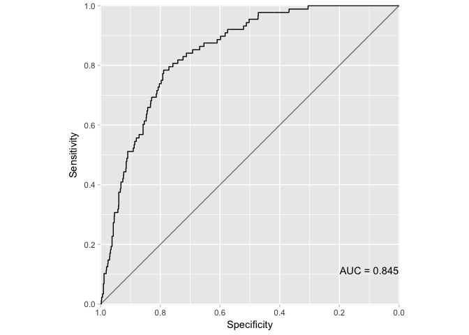<!-- -->

To study the interaction effects, we look at
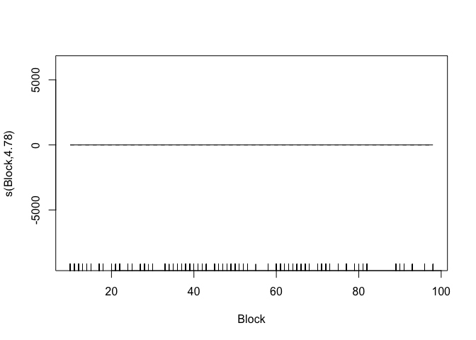<!-- -->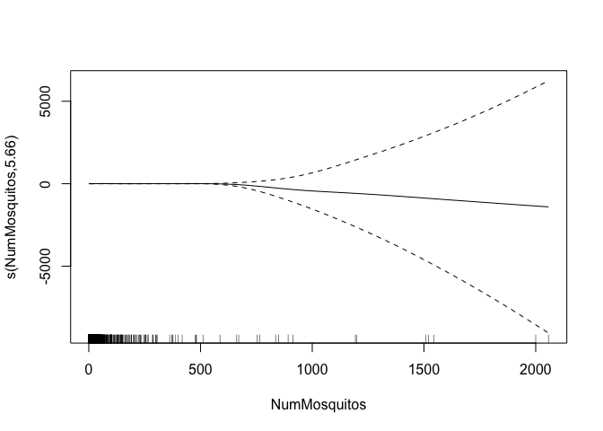<!-- -->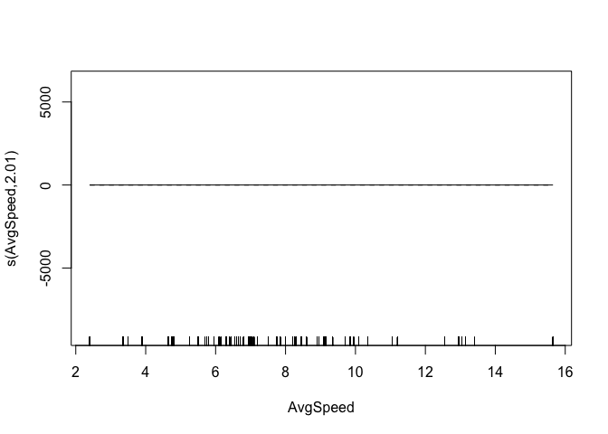<!-- -->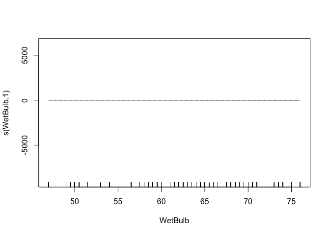<!-- -->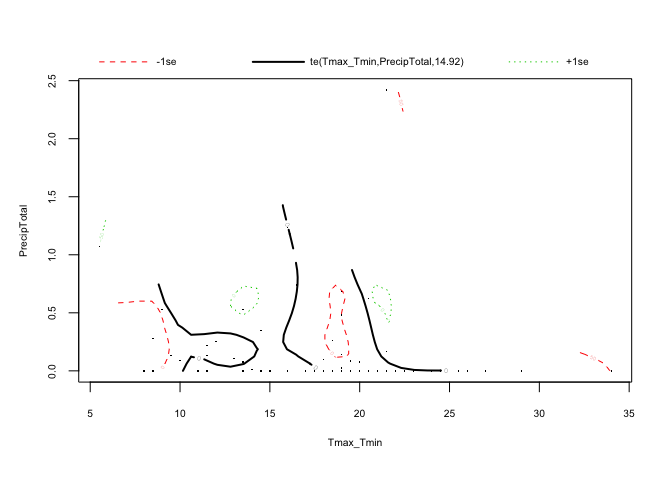<!-- -->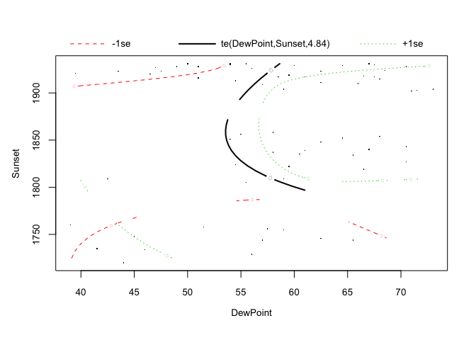<!-- -->

Finally, we run a random forest to see how our models are doing.

```
## Area under the curve: 0.8205
```

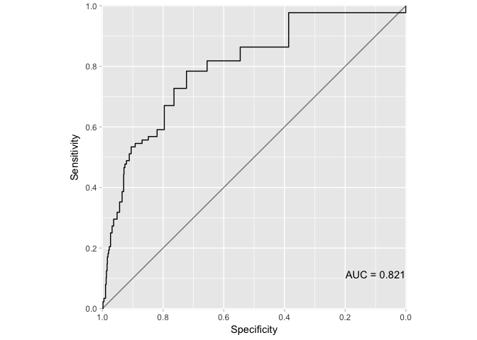<!-- -->

Oddly enough, the GAM does better than the random forest. 

## Number of Mosquitos

In the final stage we look at the factors that determine the number of mosquitos, since our best performing model picked that as a statistically significant variable. We fit two models - a linear regression and a possion regresison - and compare their performance using MSE.   


```
## 
## Call:
## lm(formula = NumMosquitos ~ dMonth + Block + Species2 + Latitude * 
##     Longitude + AvgSpeed + WetBulb + Tmax_Tmin * PrecipTotal + 
##     DewPoint * Sunset * Sunrise, data = x1)
## 
## Residuals:
##     Min      1Q  Median      3Q     Max 
##  -63.72  -16.55   -5.63    5.36 1999.79 
## 
## Coefficients:
##                            Estimate Std. Error t value Pr(>|t|)    
## (Intercept)               3.588e+06  3.839e+05   9.346  < 2e-16 ***
## dMonth06                  1.516e+01  8.412e+00   1.802 0.071611 .  
## dMonth07                 -1.254e-01  8.671e+00  -0.014 0.988462    
## dMonth08                  2.039e+00  9.807e+00   0.208 0.835345    
## dMonth09                 -1.306e+01  1.183e+01  -1.104 0.269456    
## dMonth10                 -9.206e+00  1.421e+01  -0.648 0.517006    
## Block                    -2.704e-01  3.947e-02  -6.850 8.19e-12 ***
## Species2CULEX RESTUANS   -8.738e+00  2.371e+00  -3.686 0.000230 ***
## Species2CULEX PIPIENS     2.993e+00  2.329e+00   1.285 0.198794    
## Species2CULEX SALINARIUS -2.056e+01  8.716e+00  -2.359 0.018350 *  
## Species2CULEX TERRITANS  -1.994e+01  5.380e+00  -3.706 0.000213 ***
## Species2CULEX TARSALIS   -1.321e+01  2.846e+01  -0.464 0.642636    
## Latitude                 -8.614e+04  9.177e+03  -9.386  < 2e-16 ***
## Longitude                 4.101e+04  4.380e+03   9.364  < 2e-16 ***
## AvgSpeed                  1.020e-01  4.594e-01   0.222 0.824361    
## WetBulb                   1.782e+00  1.082e+00   1.647 0.099643 .  
## Tmax_Tmin                -8.269e-01  3.109e-01  -2.659 0.007851 ** 
## PrecipTotal              -5.013e+01  1.205e+01  -4.158 3.26e-05 ***
## DewPoint                  1.799e+02  9.716e+01   1.851 0.064167 .  
## Sunset                    5.685e+00  3.064e+00   1.855 0.063598 .  
## Sunrise                   2.057e+01  1.073e+01   1.917 0.055237 .  
## Latitude:Longitude       -9.814e+02  1.047e+02  -9.378  < 2e-16 ***
## Tmax_Tmin:PrecipTotal     2.043e+00  6.258e-01   3.265 0.001102 ** 
## DewPoint:Sunset          -9.241e-02  4.988e-02  -1.853 0.063974 .  
## DewPoint:Sunrise         -3.361e-01  1.750e-01  -1.921 0.054833 .  
## Sunset:Sunrise           -1.038e-02  5.518e-03  -1.881 0.060039 .  
## DewPoint:Sunset:Sunrise   1.715e-04  9.016e-05   1.902 0.057256 .  
## ---
## Signif. codes:  0 '***' 0.001 '**' 0.01 '*' 0.05 '.' 0.1 ' ' 1
## 
## Residual standard error: 69.19 on 5589 degrees of freedom
##   (1097 observations deleted due to missingness)
## Multiple R-squared:  0.05558,	Adjusted R-squared:  0.05119 
## F-statistic: 12.65 on 26 and 5589 DF,  p-value: < 2.2e-16
```

```
## 
## Call:
## glm(formula = NumMosquitos ~ dMonth + Block + Species2 + Latitude * 
##     Longitude + AvgSpeed + WetBulb + Tmax_Tmin * PrecipTotal + 
##     DewPoint * Sunset * Sunrise, family = "poisson", data = x1)
## 
## Deviance Residuals: 
##     Min       1Q   Median       3Q      Max  
## -18.550   -3.137   -1.181    0.677   91.736  
## 
## Coefficients:
##                            Estimate Std. Error  z value Pr(>|z|)    
## (Intercept)               1.920e+05  1.315e+03  145.984  < 2e-16 ***
## dMonth06                  1.471e+00  6.777e-02   21.709  < 2e-16 ***
## dMonth07                  7.280e-01  6.915e-02   10.528  < 2e-16 ***
## dMonth08                  9.060e-01  7.107e-02   12.748  < 2e-16 ***
## dMonth09                  6.700e-02  7.486e-02    0.895    0.371    
## dMonth10                  3.861e-01  8.551e-02    4.516 6.31e-06 ***
## Block                    -1.681e-02  1.744e-04  -96.409  < 2e-16 ***
## Species2CULEX RESTUANS   -8.410e-01  1.182e-02  -71.123  < 2e-16 ***
## Species2CULEX PIPIENS     7.295e-02  7.741e-03    9.424  < 2e-16 ***
## Species2CULEX SALINARIUS -2.716e+00  9.304e-02  -29.194  < 2e-16 ***
## Species2CULEX TERRITANS  -2.395e+00  4.750e-02  -50.422  < 2e-16 ***
## Species2CULEX TARSALIS   -2.537e+00  3.781e-01   -6.710 1.94e-11 ***
## Latitude                 -4.624e+03  3.146e+01 -146.985  < 2e-16 ***
## Longitude                 2.199e+03  1.501e+01  146.484  < 2e-16 ***
## AvgSpeed                 -1.322e-02  1.905e-03   -6.937 4.01e-12 ***
## WetBulb                   1.429e-01  4.396e-03   32.502  < 2e-16 ***
## Tmax_Tmin                -7.171e-02  1.238e-03  -57.948  < 2e-16 ***
## PrecipTotal              -4.909e+00  8.484e-02  -57.861  < 2e-16 ***
## DewPoint                  1.837e+01  4.543e-01   40.433  < 2e-16 ***
## Sunset                    5.583e-01  1.414e-02   39.477  < 2e-16 ***
## Sunrise                   1.911e+00  4.871e-02   39.242  < 2e-16 ***
## Latitude:Longitude       -5.267e+01  3.587e-01 -146.803  < 2e-16 ***
## Tmax_Tmin:PrecipTotal     2.169e-01  4.197e-03   51.665  < 2e-16 ***
## DewPoint:Sunset          -9.271e-03  2.313e-04  -40.079  < 2e-16 ***
## DewPoint:Sunrise         -3.173e-02  7.983e-04  -39.744  < 2e-16 ***
## Sunset:Sunrise           -9.468e-04  2.483e-05  -38.124  < 2e-16 ***
## DewPoint:Sunset:Sunrise   1.578e-05  4.071e-07   38.756  < 2e-16 ***
## ---
## Signif. codes:  0 '***' 0.001 '**' 0.01 '*' 0.05 '.' 0.1 ' ' 1
## 
## (Dispersion parameter for poisson family taken to be 1)
## 
##     Null deviance: 279438  on 5615  degrees of freedom
## Residual deviance: 173220  on 5589  degrees of freedom
##   (1097 observations deleted due to missingness)
## AIC: 191694
## 
## Number of Fisher Scoring iterations: 7
```

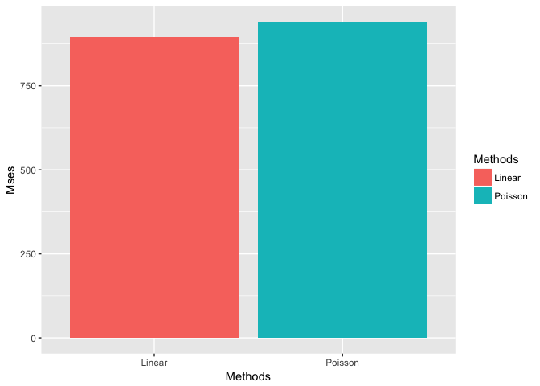<!-- -->

As we can see, in terms of MSE, the linear model does a bit better.
